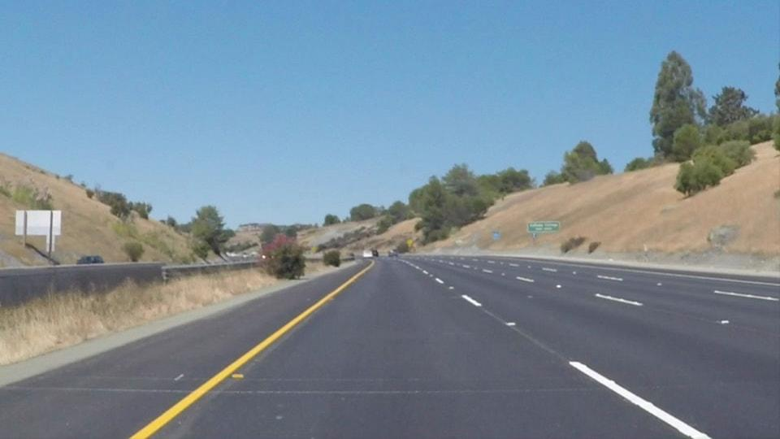
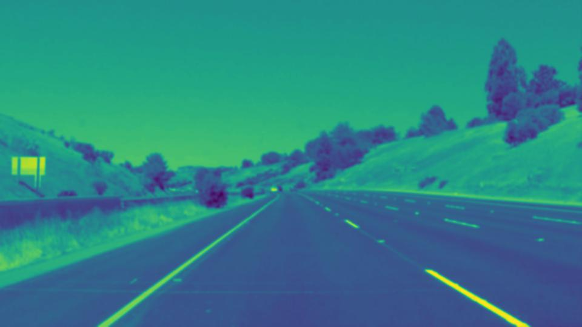
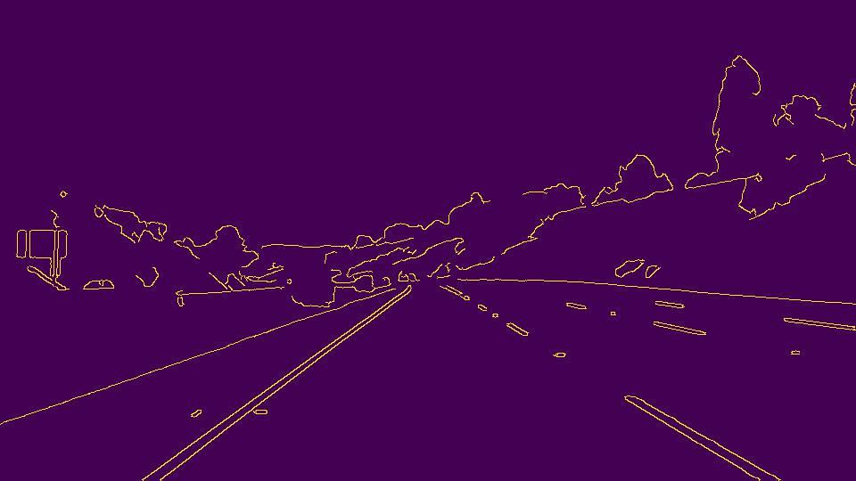
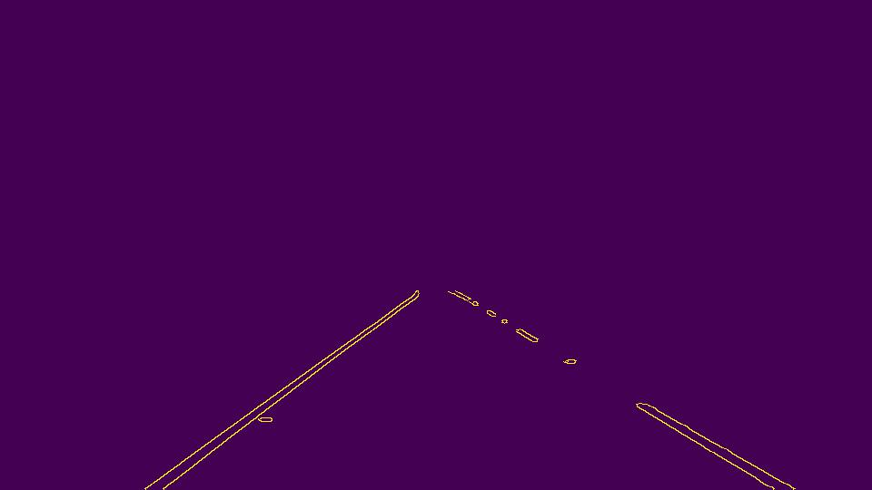
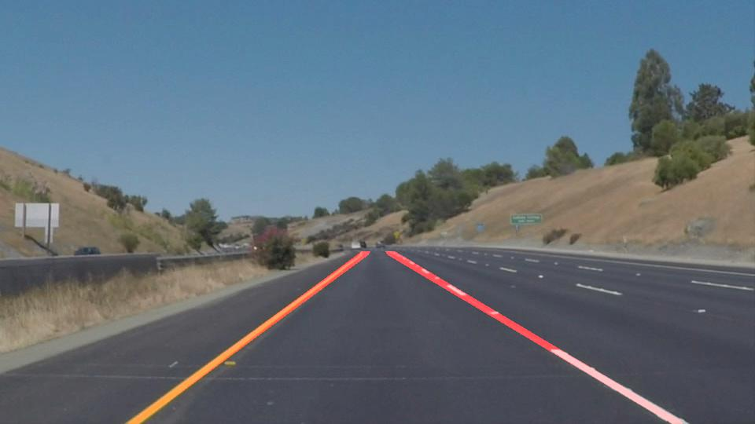

# **Finding Lane Lines on the Road** 

---

**Finding Lane Lines on the Road**

The goals / steps of this project are the following:
* Make a pipeline that finds lane lines on the road
* Reflect on your work in a written report

---

## Reflection

### 1. Describe your pipeline. As part of the description, explain how you modified the draw_lines() function.

*Original image*

My pipeline consists of several steps. First, I converted the images to grayscale, then I put a Gaussian blur with kernel size 7 on the grayscaled images. 

*Grayscaled and Gaussiant blured image*

In the next step canny is used to identify edges of the lines on the street. I chose the low threshold of 60 and the high threshold of 130 to detect signification edges but also to avoid missing more fainted ones.

*Result after Canny Edge Detection*

Afterwards, a suitable mask defined by a polygon is put on the image to extract the relevant region of interest.

*Result after Region Of Interest extraction*

In the next step all kind of relevant line processing is performed. Here, the Hough Transformation is applied to identify and get all relevant lines. The parameters were experimentally determined and promised the best result. 
Afterwards, to improve the results of the draw_lines() function the output lines of the Hough Transformation are post-processed. 

The post-processing worked as the following: 
At first a separation takes place between lines on the left side and lines on the right side. Afterwards, outliers are removed by checking the angle of each line. Moreover, the mean of the respective lines is calculated and their start and end points are expanded. 
The start point of the lines is set to the bottom of the image where in the driving scenarios of this project the line always starts. The end point is expanded so that the respective lines in the image are mostly detected with having as less wrong positives as possible. 
After that, the right and left line are concatenated. 
Additionally, an average of this final line set with the final line set from the previous image can be calculated to reduce the outliers.

In the last step, the defined region of interest is extracted again to reduce the probability of outliers and the raw images is overlapped with the processed final lines.

*Final images with detected lines*

Optionally, the raw image, the interim results and the final generated image can be plotted.

### 2. Identify potential shortcomings with your current pipeline

One potential shortcoming would be that some assumptions which have been made for to be processed images are not satisfied anymore. For example if the car is not driving in the center of the lane and hence the region of interest needs to be adapted. Furthermore, the extrapolation is not very robust due to an assumption for a linear progression of the lines is made, however in curves this is not the case.

Another shortcoming could be outliers for which more advanced algorithms are needed to remove them, like when there are white or yellow objects in the region of interest which are no lines.

A further issue is the missing detection of some line segments due to these are obstructed, they are eliminated by filter algorithms or the detection algorithms are not precise enough.

### 3. Suggest possible improvements to your pipeline

A possible improvement would be to improve the filtering algorithms leading to less removal of line information. If more line information is available, the detected lines are more exact and less false positives are made by extrapolation. Due to lanes have significant features like color or slope, a machine learning would be beneficial to detect them.
Another potential improvement to achieve less false positives could be to improve the algorithm in detecting lines segments from far away to identify lines which fit more precise to the real world.

Furthermore, a kind of automatic region of interest adaption by checking the distance to the lines on the right and on the left side would be very beneficial in real world scenarios due it is not always the case that the vehicle is driving in the center of the street, for example if it makes a turn.  A well fitting region of interest is crucial part for a robust lane detection algorithm.

Another possibility to get the algorithm more robust is to use more information from previous frames. Instead of just computing an sliding average each frame, you could extract more features from previous frames, like line slope or length and use them to identify outliers or close gaps if some information is missing in the current frame.  This approach would also help to add information about lines which are obstructed in the current frame.
